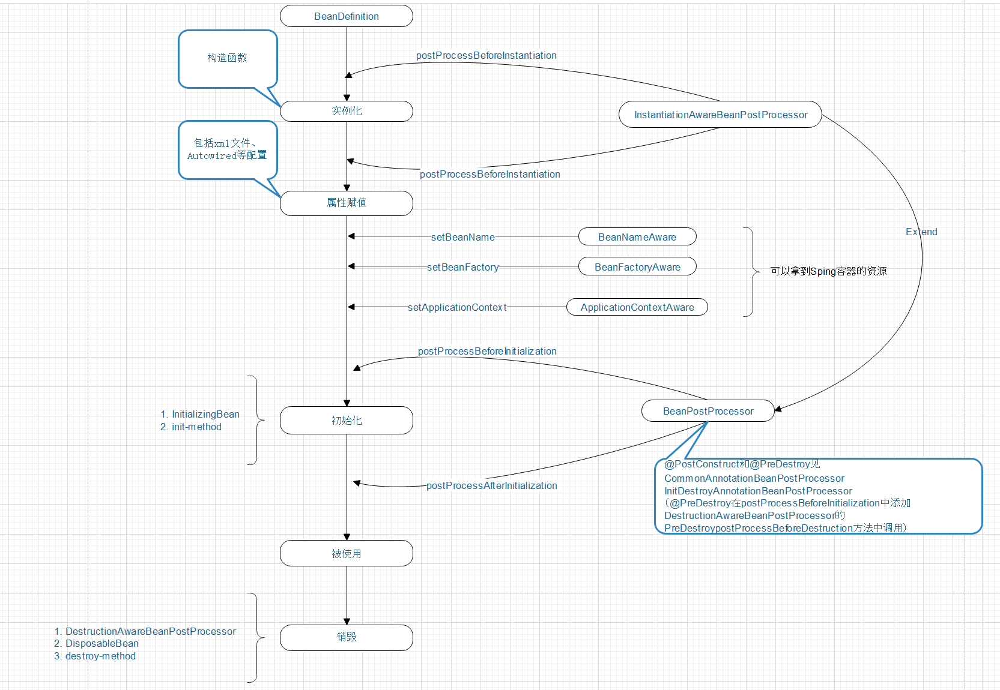

# Spring源码学习
## [bean 声明周期](bean-life/src/main/java/com/rabbin/beanlife)

### 源码参考：  
AbstractAutowireCapableBeanFactory  
InstantiationAwareBeanPostProcessor  
CommonAnnotationBeanPostProcessor  
InitDestroyAnnotationBeanPostProcessor  
DisposableBeanAdapter  
### 参考文档：  
[请别再问Spring Bean的生命周期了！](https://www.jianshu.com/p/1dec08d290c1)  
[ 也谈Spring Bean的生命周期 ](https://www.iteye.com/blog/sexycoding-1046775)  
[Spring 实战 第四版]
